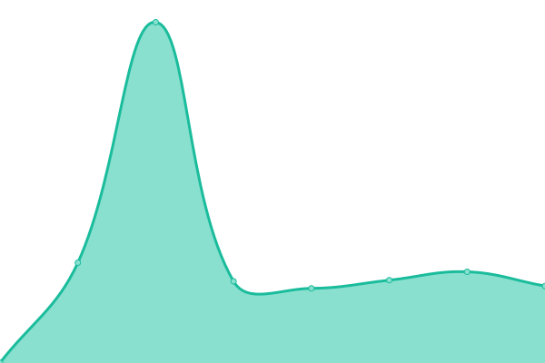
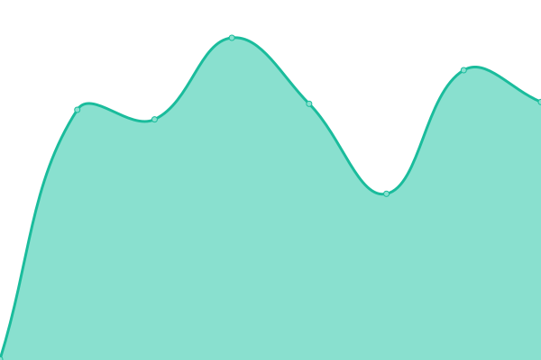
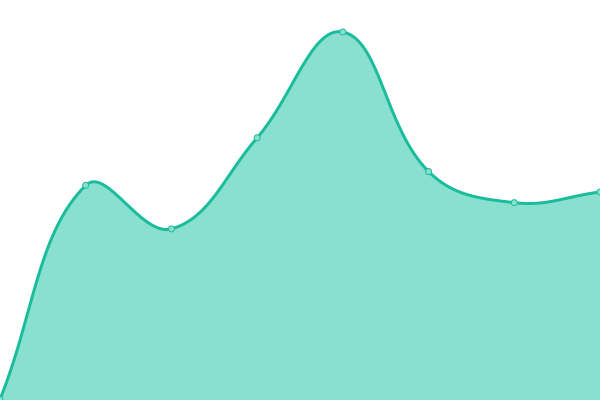

# [📈 Live Status](https://ben256dev.github.io/upptime): <!--live status--> **🟩 All systems operational**

This repository contains the open-source uptime monitor and status page for [Benjamin](ben256.com), powered by [Upptime](https://github.com/upptime/upptime).

With [Upptime](https://upptime.js.org), you can get your own unlimited and free uptime monitor and status page, powered entirely by a GitHub repository. We use [Issues](https://github.com/ben256dev/upptime/issues) as incident reports, [Actions](https://github.com/ben256dev/upptime/actions) as uptime monitors, and [Pages](https://ben256dev.github.io/upptime) for the status page.

<!--start: status pages-->
<!-- This summary is generated by Upptime (https://github.com/upptime/upptime) -->
<!-- Do not edit this manually, your changes will be overwritten -->
<!-- prettier-ignore -->
| URL | Status | History | Response Time | Uptime |
| --- | ------ | ------- | ------------- | ------ |
|  [Ben256](https://ben256.com) | 🟩 Up | [ben256.yml](https://github.com/ben256dev/upptime/commits/HEAD/history/ben256.yml) | 

 386ms
     
 | 

<a href="https://ben256dev.github.io/upptime/history/ben256">100.00%</a>
    

|  [Audioma](https://audioma.app) | 🟩 Up | [audioma.yml](https://github.com/ben256dev/upptime/commits/HEAD/history/audioma.yml) | 

 349ms
     
 | 

<a href="https://ben256dev.github.io/upptime/history/audioma">99.34%</a>
    

|  [ShtHub](https://shthub.org) | 🟩 Up | [sht-hub.yml](https://github.com/ben256dev/upptime/commits/HEAD/history/sht-hub.yml) | 

 344ms
     
 | 

<a href="https://ben256dev.github.io/upptime/history/sht-hub">100.00%</a>
    

|  [La Manga Tacos](https://lamangatacos.com) | 🟩 Up | [la-manga-tacos.yml](https://github.com/ben256dev/upptime/commits/HEAD/history/la-manga-tacos.yml) | 

 498ms
     
 | 

<a href="https://ben256dev.github.io/upptime/history/la-manga-tacos">100.00%</a>
    

|  [NightDiff](https://nightdiff.review) | 🟩 Up | [night-diff.yml](https://github.com/ben256dev/upptime/commits/HEAD/history/night-diff.yml) | 

 622ms
     
 | 

<a href="https://ben256dev.github.io/upptime/history/night-diff">100.00%</a>
    

<!--end: status pages-->

[**Visit our status website →**](https://ben256dev.github.io/upptime)

## 📄 License

- Powered by: [Upptime](https://github.com/upptime/upptime)
- Code: [MIT](./LICENSE) © [Anand Chowdhary](https://anandchowdhary.com), supported by [Pabio](https://pabio.com)
- Data in the `./history` directory: [Open Database License](https://opendatacommons.org/licenses/odbl/1-0/)
